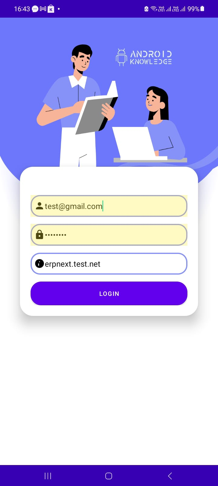
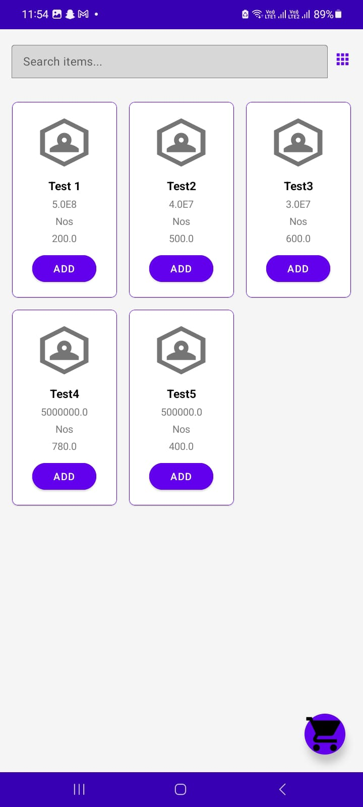

# 📱 POS SYNC

**POS SYNC** is a lightweight Android-based mobile POS (Point of Sale) application designed to seamlessly integrate with your **ERPNext** system. It enables users to perform POS operations, manage customers, handle multi-payment methods, and even query the ERPNext database using an AI-powered chatbot.

---

## 🚀 Features

- ✅ **Quick Setup**
  - Enter your **ERPNext site**, **username**, and **password** once — no need to re-enter every time.
  - Site info is securely stored locally until manually cleared.

- 🧾 **POS Functionality**
  - Create **Sales Invoices** (default) or **Sales Orders** — easily switch in **Settings**.
  - Load and continue from **previous transactions** or any saved **Draft** documents.
  - Perform **Returns** directly from the app.

- 👥 **Customer Management**
  - Add new customers on the fly and sync them with your ERPNext system.

- 📦 **Sales Item Management**
  - Items are auto-loaded from the **POS Profile** in ERPNext.
  - Ensure the following are configured in ERPNext:
    - A **POS Profile** assigned to the user
    - A default **Warehouse**
    - At least one **Payment Method**

- 💳 **Multi-Payment Support**
  - Accept multiple payment methods in a single transaction.
  - Issue **Receipts** using various available formats.

- 🤖 **AI Chat Assistant (LLM Bot)**
  - Ask questions and query data from your ERPNext database using a built-in AI chatbot.
  - Powered by OpenAI API.
  - ➕ **To enable**, add your API key in the `ChatAdapter.kt` file:
    ```kotlin
    // Replace YOUR_API_KEY with your actual key
    val apiKey = "YOUR_API_KEY"
    ```

---

---

## 📸 Screenshots

Below are some screenshots of the POS SYNC app in action:

<p align="center">
  
  
  
  
  
  
  
  
  
  
  
  
  
  
  
</p>


## 📂 Project Structure

The codebase is structured with simplicity in mind — files are not heavily nested to make it easier for anyone to explore, use, and continue building on.

> This is a developer-friendly base that’s perfect for customization and future upgrades.

---

## 🛠 Requirements

- Android Studio (latest recommended)
- ERPNext v13 or higher
- Internet connection
- OpenAI API Key (for LLM Chatbot)

---

## 📦 Installation & Usage

1. Clone the repository:
   ```bash
   git clone https://github.com/your-username/pos-sync.git
